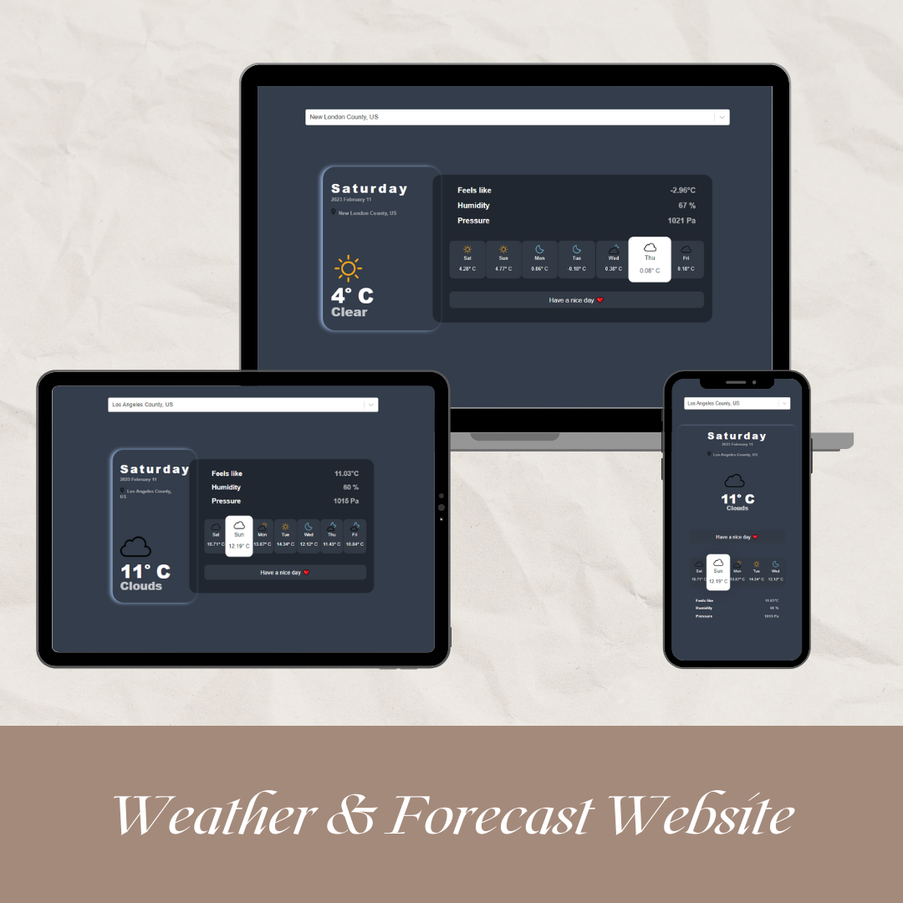

# React Weather App

A simple weather app built on top of openweathermap & GeoDB Cities Apis
![App screens]

## Getting started

- Sign up over [openweathermap](https://home.openweathermap.org/api_keys) and get an API key.
- Sign and subscribe up over [openweathermap](https://rapidapi.com/wirefreethought/api/geodb-cities/) to get an API key.
- Fork the project and clone it locally.
- Install dependencies using npm:

  ```sh
  npm install
  ```

- Inside the components file at api.js `src\components\api.js` write the keys you get from openweathermap & GeoDB:

  ```
  export const GEODB_OPTIONS = {
  method: 'GET',
  headers: {
  	'X-RapidAPI-Key': 'The API key you obtained from geodb-cities',
  	'X-RapidAPI-Host': 'wft-geo-db.p.rapidapi.com'
    }
  };
  export const GEODB_CITIES = 'https://wft-geo-db.p.rapidapi.com/v1/geo/adminDivisions';

  export const OPEN_WEATHER_KEY = `The API key you obtained from openweathermap`;
  export const OPEN_WEATHER_URL = `https://api.openweathermap.org/data/2.5`;
  ```

- Start the project :

  ```sh
  npm start
  ```

# APIs

- Cities options and location - longitude & latitude - are retrieved from https://rapidapi.com/wirefreethought/api/geodb-cities
- Weather and Forecast are retrieved from [https://home.openweathermap.org](https://openweathermap.org/)
